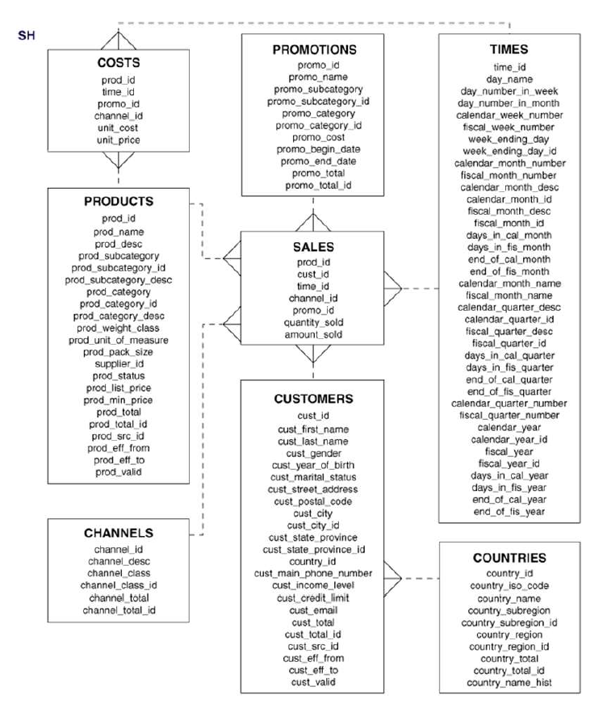
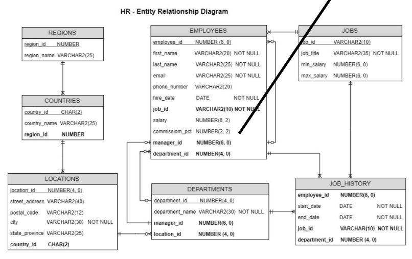
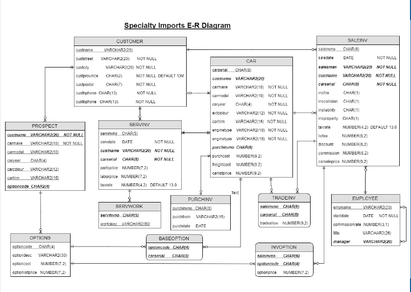

<br><br>


## This is class notes of mine from DBAS32100 lecture
## Professor : Shalini Singh Jaspal
## Modified By: Ali Cemilcan Ciftarslan
## Sheridan College

#### Review Those tables for queries
<br><br>
<br><br>
<br><br>


                            ~07/06/2020~

* Show job_titles that have a maximum salary of 16000
```sql
  Select job_title as 
"Job Titles"  from hr.jobs 
Where max_salary = 16000
```
* Show the customer names that own 2012 Mercedes from SI table:

```sql
Select custname
from si.car
Where UPPER(carmake) = 'MERCEDES'
and caryear = 2012
and custname IS NOT NULL
```
*Upper returns char with all letters uppercase.*

## SQL Review
* Data Definition Language (DLL)
  * Create
  * Alter 
  * Truncate
  * DROP
  * Rename
* Data Manuoulation Language(DML)
  * INSERT
  * UPDATE
  * DELETE
  * MERGE
*  Data Query Language (DQL)
   * SELECT
*  Transa tion Control Language (TCL)
   * Commit
   * Rollback
   * SavePoint
* Data Control Language
  * GRANT
  * REVOKE
  


* WHERE – for filtering data based on a specified condition.
* ORDER BY – for sorting the result set.
* LIMIT – for limiting rows returned.
* JOIN – for querying data from multiple related tables.
* GROUP BY – for grouping data based on one or more columns.
* HAVING – for filtering groups.
  


SQL statements are not case sensetive
    We use UPPERCASE for 'keywords' 

#### The 4 clasuses of a basic SELECT statement
    * Select
    * From
    * Where
    * Order By

#### Scalar Functions
* Perform function operations on one single value 
    * UPPER/LOWER
    * ROUND - round off floating point numbers
    * LIKE - 
  ``` sql 
  "last name LIK '%R' show last names start with 'R' another one is last_name LIKE 'SMIT_' -> it can match with SMITH 
  /*for example; since looking for only 1 character.
  ``` 
    * SUBSTR - returns part of a string
    * SYSDATE -  returns today's date
    ``` sql 
    SELECT SUBSTR('Welcome', 4, 4)
    FROM dual;
    ```

*Exercises* <br>
• To review some of the SQL statements you have learned in Database
Design and Implementation and get familiar with HR, SH and SI
databases, try the following exercises:
1. Using HR database find out:
a) How much does Amit Banda earn?<br>
b) What are the addresses of the company locations in Tokyo? <br>
c) What is the difference between max_salary and min_salary for the president of <br>
the company?
*****************************
2. Using SH database show:<br>
 How many promotion categories are there.
3. Using SI database<br>
 Who are the customers that are interested in buying 2016 Jaguar XE
23
```sql

Select first_name, salary as "Earning"
from hr.employees
WHERE
first_name = 'Amit' and
last_name = 'Banda'

Select street_address, postal_code, city 
FROM hr.Locations
where
city  = 'Tokyo'

Select job_title , FLOOR(max_salary - min_salary)
from hr.Jobs
WHERE job_title = 'President'

/* Second Part */

Select  COUNT(DISTINCT promo_category) from SH.promotions
/* Third Pard */
Select custname from si.prospect
where caryear = 2016
and UPPER(carmake) =  'JAGUAR'
and carmodel='XE'
```
<br>

## Table Joins

<br><br>

Join creates combination from two or more tables in a single result set.

``` SQL
Select select_list
    from Table1
    [Inner] Join Table2
        ON join_condition_1
    Join Table3
        ON join_condition_2

/* Show country_id, country_name, region_name in HR database*/

Select c.country_id, c.country_name, r.region_name
from hr.countries c
join hr.regions r
On c.region_id = r.region_id
```

* Implicit vs. Explicit Joins
  Explicit use  - > JOIN keyowrds
  Implicit joins use -> WHERE condition to join tables.

``` sql

  /* Explicit */
  Select country_id, country_name, region_name 
  FROM hr.countries
  Inner Join hr.regions
    ON countries.region_id = regions.region_id


/* Implicit Join */

Select country_id, country_name, region_name
FROM hr.countries, hr.regions
WHERE countries.region_id = regions.region_id
```
* Equijoins - > When two tables are joined on the basis of equality of two columns the join is called an equijoin. For Joins like this 'USING' keyword is good practice since you simplify the querying

``` SQL
SELECT country_id, country_name, region_name
from hr.countries
Join hr.regions USING(region_id)
```
* Natural Join
  * Joinign columns are not specified.
  * Database automatically joins the tables in all comuns that have the same name in both tables
  * This works only when you need to join tables on all common columns<br>*Why we need to use natural join?*
  
``` SQL
 Select country_id, country_name, region_name
    from hr.countries
 Natural Join hr.regions
```
* Table Aliases
 * MUST NOT USE 'AS' keyword
 * when you set alias, you must use that alis name not table name

```sql
 Select country_id, country_name, region_name
    from hr.countries countries c
    Inner Join Hr.regions regions r
        ON c.region_id = r.region_id
```

<b> Using HR database, find the departments that are located in 'Toronto'
```sql
Select department_name, city
from hr.departments d
Inner Join Hr.locations l
    ON d.location_id = l.location_id
where l.city = 'Toronto'
```
* Joining more than 2 tables
```sql
/* Location Information whewere 'Amit Banda' works */
Select l.location_id, street_address, city, first_name
    from hr.employees e
    Join hr.departments d
    On e.department_id = d.department_id
    Join hr.locations l
    On l.location_id = d.location_id
        Where first_name = 'Amit' and last_name = 'Banda'
```

```sql
/* Show the region in which each department is located */
Select department_name, region_name, country_name
    from hr.departments d
    Join hr.locations l
    On l.location_id = d.location_id
    Join hr.countries c
    ON c.country_id = l.country_id
    Join hr.regions r
    On r.region_id = c.region_id
```
* Outer Joins <br>
  #### Left Join<br>
   Bring *all* the rows from the left table combined with matching rown from right table. Rows that are not matching with right table will be NULL.
  #### FULL join<br>
    Brings all the rows from both tables
```sql
 Select select_list
 From table_1
 {Left|Right|Full} [OUTER] Join table_2 
    ON join_condition_2
 {Left|Right|Full} [OUTER] Join table_3
    ON join_condition_1
```
```sql
/* Show all employee names and their employment end_date if they have been terminated( they may have been terminated more than once)*/
Select e.first_name, j.end_date
FROM hr.employees e
Right Join hr.job_history j
    ON j.employee_id = e.employee_id
    where  j.end_date is not NULL

/* Now we can write it with Implicit Outer Join*/
SELECT first_name, last_name, end_date
FROM hr.employees e, hr.job_history jh
WHERE e.employee_id = jh.employee_id(+);


/* Show all employee names and their departments (if they belongs to) */

Select e.first_name, d.department_name 
FROM hr.employees e
Right JOIN hr.departments d
    ON d.department_id = e.department_id
    AND  e.department_id IS NOT NULL 
    AND e.employee_id is not null

```
* Recursive Relationship <br>
    Foreign key its own primary key, just like employee table and check the manager_id.
```sql`
/* Find the manager of 'John Chen' */
Select first_name, last_name
from hr.employees
Where employee_id=(Select manager_id
from hr.employees
where first_name = 'John' AND last_name='Chen');
```
In Oracle database you can do recursion with single query using *level*
```sql
    Select fist_name, last_name, level from hr.employees 
        from hr.employees
    Coonect By Prior manager_id = employee_id
        Start With frist_name='John' AND last_name='Chen'
```
* Self Join<br>
    We can achieve the same result with self join.
    Self join is a join of a table with itself. Joining two copies of the same table. Same table is used, to distinguish between two copies you must use aliance
``` SQL
Select e.first_name, e.last_name
from hr.employees e
JOIN hr.employees b
    ON e.employee_id = b.manager_id
where b.first_name='John' and b.last_name='Chen';
```